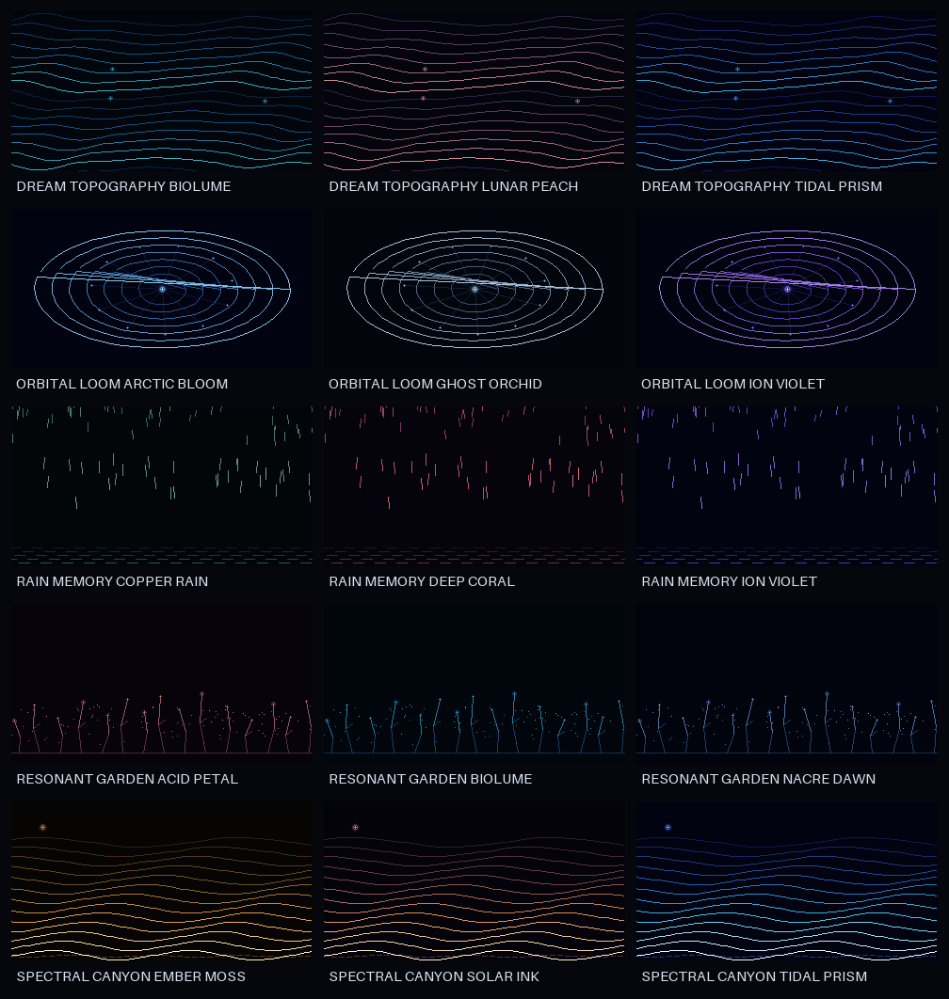

# OpenAI Snyth Models

An original, resource-bounded sound and display laboratory for the Sancte3D
AMBIENT instrument. The directory name preserves the requested spelling;
`Snyth` is intentional here.

The package contains ten playable synthesis models, eighteen audio-reactive
display models, and twelve embedded colour palettes. Every sound and display geometry
is generated at runtime from original C code. No
recorded samples, MIDI files, extracted presets, transcribed melodies, or
third-party source code are required.

## Sound models

| # | Model | Character | Primary method |
|---:|---|---|---|
| 1 | ACID RAIN | elastic droplets and damp reflections | falling resonators + procedural excitation |
| 2 | FM GLASS | clear mallets with a soft halo | original two-operator phase modulation |
| 3 | CHORUS MIST | wide, slow-breathing pad | detuned analytic oscillators + short chorus |
| 4 | ION STORM | dark electrical air and distant sparks | subharmonics + bounded stochastic accents |
| 5 | GLASS ORBIT | rotating inharmonic bells | four analytic partials + moving pan |
| 6 | BAMBOO CIRCUIT | organic plucks with electronic grain | compact feedback string model |
| 7 | NACRE HORIZON | pearly, almost weightless harmonic bed | sparse open partial field |
| 8 | TIDEGLASS | fluid FM pad with slow refraction | continuously moving modulation ratio |
| 9 | LUMEN SWARM | small lights collecting into harmony | deterministic micro-oscillator cluster |
| 10 | HOLLOW CHOIR | distant vowel-like breath | moving formant partial field |

The presets are starting points only. Six smoothed macros—color, motion,
space, texture, width, and level—make every model performable from the existing
encoder vocabulary.

## Display models

The renderers target a 320 × 170 packed 4-bit framebuffer and need no second
framebuffer or FFT. Five foundational systems cover landscapes, particles, and
contours:

- RESONANT GARDEN — bass grows stems, treble releases luminous pollen.
- ORBITAL LOOM — spectral energy weaves rotating harmonic threads.
- SPECTRAL CANYON — frequency bands become receding animated ridges.
- RAIN MEMORY — transients fall, low energy opens lingering rings.
- DREAM TOPOGRAPHY — the sound continuously redraws a contour-map dream.

Thirteen additional systems explore sound-reactive menu focus, neon spectrum
veins, crystalline needles, abstract radial gates, organic signal ribbons,
path drawing, particle currents, wireframe rain, waveform shells, glitch
halos, bilateral pulses, falling chroma, and radial softbursts. They translate
high-level motion principles into newly authored geometric C renderers; no
reference pixels or recognizable reference figures are included.

The same nibble buffer can act as a 16-colour palette index. Twelve slowly
animated RGB565 LUTs add colour for only 32 bytes of LUT storage. See
[docs/UI_MODELS.md](docs/UI_MODELS.md) for control mappings,
[docs/MOTION_STUDY_CATALOG.md](docs/MOTION_STUDY_CATALOG.md) for the new
systems, and [docs/REFERENCE_MOTION_ANALYSIS.md](docs/REFERENCE_MOTION_ANALYSIS.md)
for the clean translation record. The package includes 46 GIFs: five base
previews, fifteen foundational colour studies, and 26 new motion studies.




## Build and verify

Requires a C11 compiler, `make`, and `rg`. Preview generation additionally uses
`ffmpeg`; the colour encoder uses the Pillow version pinned in
`requirements-preview.txt`.

```sh
make verify
make sanitize
make benchmark
make visual-benchmark
make previews
make manifest
sha256sum -c SOURCE_MANIFEST.sha256
sha256sum -c ASSET_MANIFEST.sha256
```

The state budgets are compile-time assertions:

- audio model context: at most 32,768 bytes;
- visual context: at most 2,048 bytes;
- existing packed framebuffer: 27,200 bytes;
- 16-entry RGB565 palette LUT: 32 bytes;
- additional display framebuffer: 0 bytes.

## Commercial-use posture

The implementation was written from a blank design for this project and is
kept isolated inside this directory. `docs/ORIGINALITY_AND_IP.md` records its
provenance and limits. This is a technical clean-origin package, not a legal
opinion or a trademark clearance. Before shipping, the rights holder should
complete the checklist in that document and choose a customer-facing product
name that does not imply endorsement by another company.

Copyright © 2026 Sancte3D. All rights reserved. See
[LICENSE-PROPRIETARY.md](LICENSE-PROPRIETARY.md).
