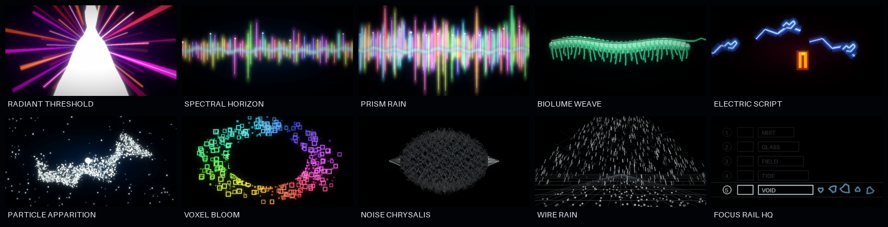

# High-quality cinematic display loops

The high-quality set is a clean-room visual redesign for the native 320 × 170
display. It exists because the earlier 4-bit line studies were useful firmware
prototypes but did not reproduce the references' most important optical
qualities: luminous volume, bloom, overexposed cores, depth, persistence, and
large fields of controlled darkness.



## What changed

`tools/render_high_quality_visuals.py` draws each scene at 640 × 340, combines
separate coloured bodies and white light cores, applies near and far bloom,
then reduces the image once with Lanczos filtering. A stable global GIF palette
is built independently for every loop. All movement is deterministic and
periodic; no reference file, source frame, texture, model, or downloaded asset
is read by the renderer.

The build-time pipeline uses Pillow and NumPy. Neither library is linked into
the device firmware.

## Model set

| Loop | Optical construction | Motion construction | Deliberate original separation |
|---|---|---|---|
| **RADIANT THRESHOLD** | clipped white aperture, magenta/red beam bodies, violet field | 54 independently flaring and steering rays | abstract symmetric threshold; no person, clothing, or traced outline |
| **SPECTRAL HORIZON** | sparse coloured needles around a white irregular seam | low-amplitude multi-rate length modulation | new seeded spectrum and placement |
| **PRISM RAIN** | 116 tapered crystals with coloured bloom and narrow white cores | independent 2–5× periodic length, center, and position motion | no source needle positions, colours, or frames retained |
| **BIOLUME WEAVE** | 32 shaded overlapping cells, dorsal filament, 43 procedural fibres | two coupled travelling waves and compression | signal weave rather than a reproduced animal anatomy |
| **ELECTRIC SCRIPT** | blue phosphor fragments and a warm tuning beacon | twelve-step packet relay with intentional holds | original route, rune packets, and beacon geometry |
| **PARTICLE APPARITION** | 1,900 body particles, 145 stars, clipped nucleus | particles gather from a diffuse field into a new parametric current | no source silhouette or particle coordinates |
| **VOXEL BLOOM** | 510 outlined and filled chromatic cells around a black cavity | radial breathing, local drift, and slow hue rotation | new ellipse, distribution, sizes, and colour mapping |
| **NOISE CHRYSALIS** | 92 filled cross-sections, 16 shell traces, lateral caustics | independently travelling turbulence fields | original volume equations rather than sampled noise footage |
| **WIRE RAIN** | perspective floor, mesh canopy, 860 streaks, 150 floor nodes | integer-rate wrap cycles for a seamless fall | new camera, mesh, node field, and rain trajectories |
| **FOCUS RAIL HQ** | restrained monochrome rows plus five sound-state glyphs | cosine focus travel through all rows and back | original labels, proportions, icons, and selection sequence |

Every loop contains 48 native-size frames. Frame delays vary from 40 to 80 ms
because a menu, an organism, and an explosive light system should not share one
motion tempo. `ui/previews/high-quality/frame-sheets` contains a numbered image
of all 48 frames for every loop.

## Verification

`tools/verify_high_quality_visuals.py` rejects missing or duplicate assets,
wrong geometry, wrong frame timing, weak motion, a discontinuous loop, absent
negative space, missing mid-level light volume, neutralized colour bodies, and
excessive still-to-GIF palette drift. The current ten loops pass with 28–48
distinct decoded frames; the lower count belongs to the deliberately stepped
ELECTRIC SCRIPT holds.

## Capacity truth

These files are art-direction masters, not a claim that the existing 4-bit C
renderer produces the same pixels. The full GIF set is about 9 MB; individual
loops range from roughly 316 KB to 1.6 MB. Frame sheets and stills bring the
review directory to about 16 MB.

Three product paths are realistic:

1. **External-flash playback:** retain the full indexed look, store only the
   selected three to five loops, and stream decoded scanlines to the LCD. This
   needs storage plus a measured decoder but does not require a second full
   RGB framebuffer.
2. **54.4 KB indexed frame:** decode to one 8-bit 320 × 170 index buffer and use
   a per-loop RGB565 palette. This preserves substantially more colour than the
   current 27.2 KB nibble buffer but must be approved against the product map.
3. **Strict 27.2 KB procedural port:** translate the chosen recipes to a 4-bit
   light field and calculate hue from position during row conversion. This is
   the smallest route, but the port must be compared against these masters and
   cannot honestly promise identical gradients.

Do not place all ten GIFs in internal MCU flash by default. First select the
three strongest directions on the physical panel, then profile storage,
decoder cycles, SPI bandwidth, and audio/display contention on target.

## Regeneration

```sh
make hq-ui-previews
make verify-hq-previews
```

The generated loops, stills, frame sheets, and contact sheet contain only
project-authored pixels. Reference frame sheets created by
`tools/analyze_reference_motion.py` are review outputs and remain outside this
repository.
