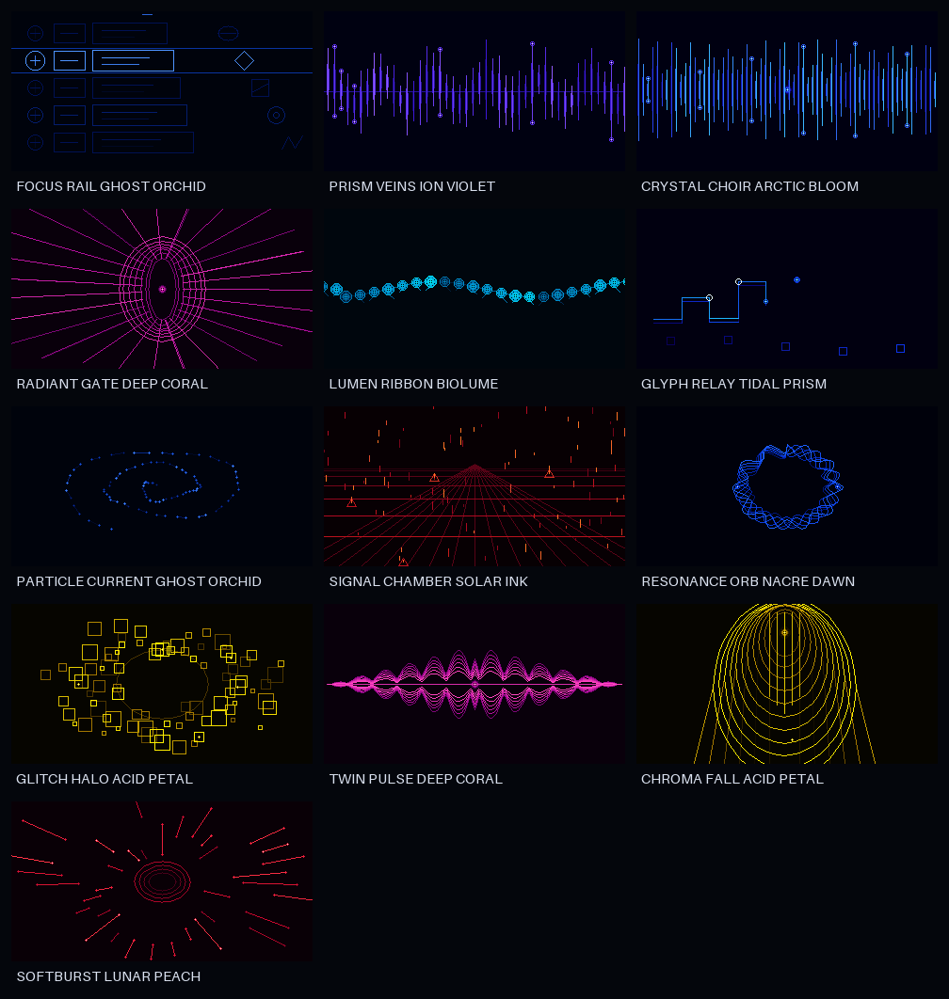

# Thirteen new motion systems

> These packed-framebuffer studies remain useful as low-cost firmware
> prototypes. They are not the final visual-quality target. The later
> supersampled cinematic redesign is documented in
> [HIGH_QUALITY_VISUALS.md](HIGH_QUALITY_VISUALS.md).

The second visual set adds thirteen original, sound-reactive renderers and 26
native-resolution GIFs. Each renderer has two palette treatments. Together
with the five foundational systems, the firmware now exposes eighteen display
modes.

## Model catalog

| Index | System | Audio mapping | Primary / alternate palette |
|---:|---|---|---|
| 5 | FOCUS RAIL | RMS brightens focus; timed state selects rows | GHOST ORCHID / SOLAR INK |
| 6 | PRISM VEINS | bass lengthens streaks; mid bends the center; high adds tips | ION VIOLET / TIDAL PRISM |
| 7 | CRYSTAL CHOIR | bass expands reach; high increases crystal shimmer | ARCTIC BLOOM / NACRE DAWN |
| 8 | RADIANT GATE | RMS drives beam strength; mid breathes the aperture | DEEP CORAL / ION VIOLET |
| 9 | LUMEN RIBBON | bass undulates the body; high grows signal fibres | BIOLUME / ACID PETAL |
| 10 | GLYPH RELAY | RMS brightens the trace; high enlarges the moving head | TIDAL PRISM / LUNAR PEACH |
| 11 | PARTICLE CURRENT | bass widens flow; mid changes aspect; high adds turbulence | GHOST ORCHID / ARCTIC BLOOM |
| 12 | SIGNAL CHAMBER | high accelerates rain; RMS lifts the perspective grid | SOLAR INK / BIOLUME |
| 13 | RESONANCE ORB | bass sets radius; mid roughens shell; high adds ripples | NACRE DAWN / ION VIOLET |
| 14 | GLITCH HALO | RMS expands cells; mid deforms radius; high sparks | ACID PETAL / TIDAL PRISM |
| 15 | TWIN PULSE | bass opens amplitude; mid changes lobe spacing | DEEP CORAL / ARCTIC BLOOM |
| 16 | CHROMA FALL | bass deepens shells; mid moves the falling body | ACID PETAL / BIOLUME |
| 17 | SOFTBURST | high adds rays and length; mid opens the quiet center | LUNAR PEACH / TIDAL PRISM |

All GIFs and matching stills live in `ui/previews/motion-studies`. The full
two-palette overview is `ui/previews/motion-contact-sheet.png`.

## Product pairing suggestions

| Sound family | Calm default | Expressive alternative |
|---|---|---|
| ACID RAIN | SIGNAL CHAMBER | PRISM VEINS |
| FM GLASS | CRYSTAL CHOIR | TWIN PULSE |
| CHORUS MIST | CHROMA FALL | RESONANCE ORB |
| ION STORM | RADIANT GATE | GLITCH HALO |
| GLASS ORBIT | PARTICLE CURRENT | SOFTBURST |
| BAMBOO CIRCUIT | GLYPH RELAY | LUMEN RIBBON |
| NACRE HORIZON | RESONANCE ORB | RADIANT GATE |
| TIDEGLASS | CHROMA FALL | PRISM VEINS |
| LUMEN SWARM | LUMEN RIBBON | GLITCH HALO |
| HOLLOW CHOIR | SIGNAL CHAMBER | TWIN PULSE |

FOCUS RAIL is a menu language rather than a sound default. It demonstrates
how explicit state can coexist with an animated sound field.

## Capacity result

The additional modes reuse the existing 96-particle array and 320-entry ridge
scratch space. Visual state remains **1,444 bytes**, the packed framebuffer
remains **27,200 bytes**, and the animated RGB565 LUT remains **32 bytes**.
There is no second framebuffer and no runtime Pillow or graphics-library
dependency.

On the review host, the slowest of all eighteen renderers was still DREAM
TOPOGRAPHY at roughly 59 microseconds per frame. This is a regression signal,
not an STM32 timing guarantee; target-cycle measurement remains mandatory.
