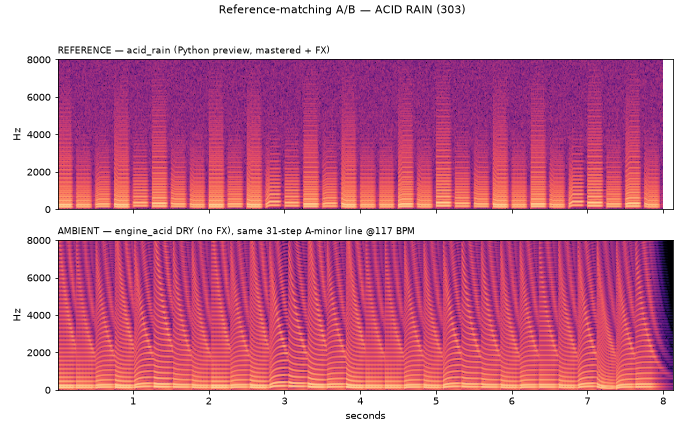

# Synth-engine reference matching

How we build the selectable synth engines (ADR-0021) so they actually sound
like the reference previews in `ambient_iconic_synth_worlds_pack`, instead of
"approximately better" guesses.

**Principle:** the Python preview WAV is the *spec*; the C engine is a *port* of
that spec. We don't invent a new ambient world — we port the synth core
(oscillators, envelopes, filter, drive, mix gains) and verify it against the
reference, measured, not by vibe.

## The workflow (order is not optional)

1. **Measure the reference WAV** — tempo, register/notes, and the spectral
   centroid envelope (the filter movement). numpy autocorrelation for pitch,
   RMS-flux for onsets, FFT for the centroid.
2. **Extract the exact note sequence** — pitch + accent per step, straight from
   the reference, so the C renderer replays the *same* events. No generative,
   no harmony_field, no randomness — a fixed loop.
3. **Render the engine DRY** — `oscillator → envelope → filter → drive →
   output`, with **no reverb / delay / diffuser / beauty-guard / texture**. If
   it sounds wrong here, the synth core is wrong, not the FX. This is the debug
   surface (`tools/render_acid_dry.c`); the wet/product render is separate
   (`tools/render_synth.c`, through the host's global FX).
4. **A/B** — listen, and compare spectrograms + RMS + centroid.
5. **Adjust the constants** and repeat 3–4.
6. **Only then add global FX**, then speaker-sim, then the real device. Hearing
   it first on hardware means debugging the synth, DAC, speaker, enclosure,
   limiter, gain-staging and power noise *all at once* — chaos.

This keeps the engines tiny and embeddable: `dsp.h` only — no malloc, no
samples, no per-sample `powf`/`sinf`.

## Worked example — ACID RAIN (303)

Reference: `ambient_world_01_acid_rain_303_inspired.wav`.

**Measured spec (from the WAV):**

| Property | Value |
|---|---|
| Tempo | ~117 BPM, straight 8th-notes (254.6 ms step) |
| Register | bass, MIDI 45–52 (A2–E3), root A2 |
| Sequence | 31 steps, A-minor — `A2 A2 C3 A2 E3 D3 C3 A2 …` |
| Filter | resonant lowpass sweeping ~1.6 k → 6.5 kHz per note (3.9× — the squelch) |
| Loudness | RMS 0.279 (mastered) |

> Note: ChatGPT's review suggested a +28-semitone harmonic oscillator and
> 128 BPM for this sound. Both are wrong for a 303 — the +28 partial belongs to
> the *Exceeder* harmonic-bass (first pack), and the measured tempo is 117, not
> 128. A real 303 is single-oscillator saw/square + resonant filter envelope.

**Engine** (`src/v2/engines/engine_acid.c`): saw (+a little square) → resonant
SVF lowpass with a per-note exp-decay envelope on the cutoff (the squelch) →
amp ADSR (6 ms / 80 ms / 0.78 / 60 ms) → tanh drive. Accent (high velocity)
opens the filter further, adds resonance, and pushes drive/level; portamento
glides legato notes. Six param slots map to Cutoff / Resonance / Decay / Drive
/ Glide / Env-amount.

**A/B result** — same 31-step line, dry vs the mastered reference:



Top = reference (mastered, with FX — note the diffuse reverb wash). Bottom =
`engine_acid` dry (clean harmonic structure, the per-note resonant sweeps line
up in time). Tempo, register and squelch character match; the dry core is
slightly brighter/cleaner because the reference is mastered + drenched in FX.
Final tone is a per-encoder/ear call.

## Reproduce

```sh
cd field-ambience-current/firmware-c-next
# DRY (debug surface) — engine only, no FX:
cc -std=c11 -O2 -Iinclude tools/render_acid_dry.c \
   src/dsp.c src/v2/engines/engine_acid.c -lm -o /tmp/render_acid_dry
/tmp/render_acid_dry /tmp/acid_dry.wav
# WET (product) — through the host's global reverb + limiter:
cc -std=c11 -O2 -Iinclude tools/render_synth.c \
   src/dsp.c src/reverb.c src/v2/beauty_guard.c src/v2/synth_host.c \
   src/v2/engines/engine_acid.c -lm -o /tmp/render_synth
/tmp/render_synth /tmp/acid.wav
```

The numeric/spectrogram comparison is generated with numpy + matplotlib against
the reference WAV from the audio pack (host-side analysis only; not shipped).

## Next engines

Same workflow, one per PR, each measured against its own reference: FM Glass
(force harmonic carrier/modulator ratios — the reference sounds unmelodic),
Chorus Mist, Ion Storm, Glass Orbit, Bamboo Circuit. Then a FIELD adapter so
the V2 ambient engine is selectable in the same host, and the SYNTH/FIELD mode
UI.
