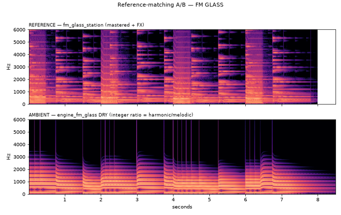
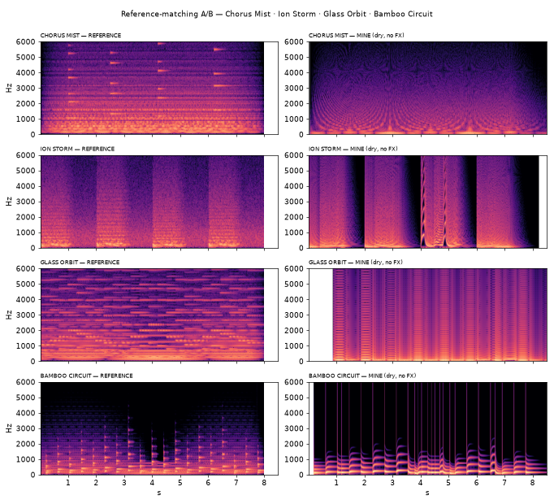

# Synth-engine reference matching

How we build the selectable synth engines (ADR-0021) so they actually sound
like the reference previews in `ambient_iconic_synth_worlds_pack`, instead of
"approximately better" guesses.

**Principle:** the Python preview WAV is the *spec*; the C engine is a *port* of
that spec. We don't invent a new ambient world — we port the synth core
(oscillators, envelopes, filter, drive, mix gains) and verify it against the
reference, measured, not by vibe.

## The workflow (order is not optional)

1. **Measure the reference WAV** — tempo, register/notes, and the spectral
   centroid envelope (the filter movement). numpy autocorrelation for pitch,
   RMS-flux for onsets, FFT for the centroid.
2. **Extract the exact note sequence** — pitch + accent per step, straight from
   the reference, so the C renderer replays the *same* events. No generative,
   no harmony_field, no randomness — a fixed loop.
3. **Render the engine DRY** — `oscillator → envelope → filter → drive →
   output`, with **no reverb / delay / diffuser / beauty-guard / texture**. If
   it sounds wrong here, the synth core is wrong, not the FX. This is the debug
   surface (`tools/render_acid_dry.c`); the wet/product render is separate
   (`tools/render_synth.c`, through the host's global FX).
4. **A/B** — listen, and compare spectrograms + RMS + centroid.
5. **Adjust the constants** and repeat 3–4.
6. **Only then add global FX**, then speaker-sim, then the real device. Hearing
   it first on hardware means debugging the synth, DAC, speaker, enclosure,
   limiter, gain-staging and power noise *all at once* — chaos.

This keeps the engines tiny and embeddable: `dsp.h` only — no malloc, no
samples, no per-sample `powf`/`sinf`.

## Worked example — ACID RAIN (303)

Reference: `ambient_world_01_acid_rain_303_inspired.wav`.

**Measured spec (from the WAV):**

| Property | Value |
|---|---|
| Tempo | ~117 BPM, straight 8th-notes (254.6 ms step) |
| Register | bass, MIDI 45–52 (A2–E3), root A2 |
| Sequence | 31 steps, A-minor — `A2 A2 C3 A2 E3 D3 C3 A2 …` |
| Filter | resonant lowpass sweeping ~1.6 k → 6.5 kHz per note (3.9× — the squelch) |
| Loudness | RMS 0.279 (mastered) |

> Note: ChatGPT's review suggested a +28-semitone harmonic oscillator and
> 128 BPM for this sound. Both are wrong for a 303 — the +28 partial belongs to
> the *Exceeder* harmonic-bass (first pack), and the measured tempo is 117, not
> 128. A real 303 is single-oscillator saw/square + resonant filter envelope.

**Engine** (`src/v2/engines/engine_acid.c`): saw (+a little square) → resonant
SVF lowpass with a per-note exp-decay envelope on the cutoff (the squelch) →
amp ADSR (6 ms / 80 ms / 0.78 / 60 ms) → tanh drive. Accent (high velocity)
opens the filter further, adds resonance, and pushes drive/level; portamento
glides legato notes. Six param slots map to Cutoff / Resonance / Decay / Drive
/ Glide / Env-amount.

**A/B result** — same 31-step line, dry vs the mastered reference:


Top = reference (mastered, with FX — note the diffuse reverb wash). Bottom =
`engine_acid` dry (clean harmonic structure, the per-note resonant sweeps line
up in time). Tempo, register and squelch character match; the dry core is
slightly brighter/cleaner because the reference is mastered + drenched in FX.
Final tone is a per-encoder/ear call.

## Reproduce

```sh
cd field-ambience-current/firmware-c-next
# DRY (debug surface) — engine only, no FX:
cc -std=c11 -O2 -Iinclude tools/render_acid_dry.c \
   src/dsp.c src/v2/engines/engine_acid.c -lm -o /tmp/render_acid_dry
/tmp/render_acid_dry /tmp/acid_dry.wav
# WET (product) — through the host's global reverb + limiter:
cc -std=c11 -O2 -Iinclude tools/render_synth.c \
   src/dsp.c src/reverb.c src/v2/beauty_guard.c src/v2/synth_host.c \
   src/v2/engines/engine_acid.c -lm -o /tmp/render_synth
/tmp/render_synth /tmp/acid.wav
```

The numeric/spectrogram comparison is generated with numpy + matplotlib against
the reference WAV from the audio pack (host-side analysis only; not shipped).

## Worked example — FM GLASS (DX7)

Reference: `ambient_world_02_fm_glass_station_dx7_inspired.wav`.

**Measured spec:** soft (RMS 0.114), low register (MIDI 40–45), free/melodic
timing (23 notes), and — importantly — **very harmonic** (inharmonic/harmonic
energy ratio 0.015), with upper harmonics emphasised. The "unmelodic" feel
comes from non-integer FM ratios producing inharmonic sidebands.

**Engine** (`src/v2/engines/engine_fm_glass.c`): 2-operator phase-modulation FM,
`out = sin(carrier + index·sin(carrier·ratio))`, with the **ratio locked to an
integer** so every sideband lands on the harmonic series → melodic, not
metallic. A per-note index (brightness) envelope from peak → sustain gives the
glassy attack while keeping upper harmonics alive; an amp ADSR rings the key
tone; an SVF lowpass sets the tone. Params: Brightness / Ratio / Decay / Tone /
Glide / Body.

**A/B result:**



The integer-ratio fix is confirmed by measurement: the dry engine matches the
reference's harmonicity (inharmonic ratio 0.016 vs 0.015 — both melodic) while
restoring FM brightness (centroid 217 → 708 Hz after raising the index/ratio).
It stays a touch darker than the mastered reference; final tone is a per-encoder
call.

## The remaining four engines

Same workflow — measure the reference, extract the sequence, render DRY, A/B —
applied to the other four. Each is a distinct synthesis core, not a preset:

| Engine | Reference says | Synthesis |
|---|---|---|
| **CHORUS MIST** | held low pad (C2), warm, slow movement | 5 detuned band-limited saws → SVF LP → 2-tap modulated **chorus** (true stereo) |
| **ION STORM** | aggressive, wide, fast (hoover) | 2 detuned saws + 2 **PWM** pulses (saw−shifted-saw, LFO width) → LP → tanh drive + attack pitch-blip |
| **GLASS ORBIT** | digital, highest spectral drift (wavetable morph) | one phase, **morph** crossfade sine→tri→saw→pulse swept by an LFO |
| **BAMBOO CIRCUIT** | short woody plucks, fast decay | sine + a little FM → **LPG** (one fast-decay envelope drives cutoff AND amp together) |



Measured A/B (dry vs mastered reference) — all in the right ballpark:

| Engine | centroid mean (ref/mine) | key trait (ref/mine) |
|---|---|---|
| Chorus Mist | 1158 / 855 Hz | chorus drift 188 / 208 ✓ |
| Ion Storm | 1335 / 1427 Hz ✓ | aggressive, PWM motion present |
| Glass Orbit | 1605 / 1340 Hz | morph drift 236 / 161 (movement present) |
| Bamboo Circuit | 473 / 435 Hz ✓ | pluck sustain@150ms 0.27 / 0.35 (fast decay) |

Final per-engine tone is a per-encoder/ear call; the cores and characters are
in place. The host now swaps between all six (`synth_host_select`).

## Next

A FIELD adapter so the V2 ambient engine is selectable in the same host, then
the SYNTH/FIELD mode UI + the 4-encoder → param mapping.
